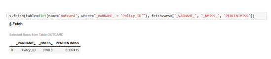
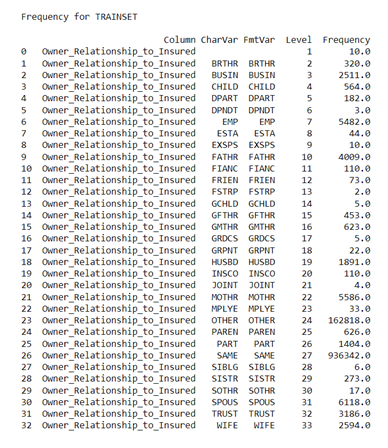
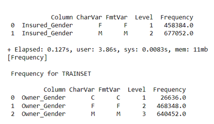
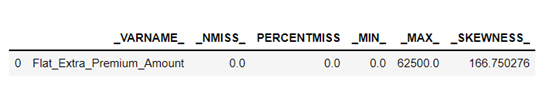
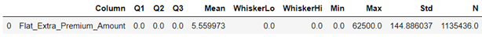

# Addressing Typical Data Quality Issues in Viya

## Table of Contents

* [Addressing Typical Data Quality Issues in Yiya](#addressing-typical-data-quality-issues-in-viya)
    * [Overview](#overview)
        * [Completeness](#completeness)
        * [Uniqueness](#uniqueness)
        * [Data Consistency](#data-consistency)
        * [Data Accuracy](#data-accuracy)
    * [Contributing](#contributing)
    * License](#license)
    * Additional Resources](#additional-resources)

## Overview
Enhancing data quality is critical as data is at the heart of all activities within organizations; poor data quality leads to inaccurate analysis and reporting which will impact business decisions. Here we will address four different data quality issues and how to identify them using CAS actions in Viya. 

**Data Completeness**: The degree to which values are present in a data collection.

**Data Uniqueness**: A measure of unwanted duplication existing within or across systems for a particular field, record, or data set.

**Data Consistency**: Violation of semantic rules defined over the dataset. .

**Data Accuracy**: Data are accurate when data values stored in the database correspond to real-world values. 

There are other factors such as Data Timeliness (The extent to which age of the data is appropriated for the task at hand) which we will not be adderssing in this article. 

There are various CAS actions that are at the disposal of a SAS data scientist to quickly check all the data qualiy issues in the analytical base table. In this article we will go through the CAS actions and how they can be manipulated to go through the necessary data quality checks. The list of CAS actionsets that are the heart of these checks are:

- Simple
- Cardinality
- Percentile
- Data Step
- Table

in addition to the popular Python packages such as:

- pandas
- matplotlib
- swat
- sklearn

### Completeness

To check for completeness or missingness in the data, a handy CAS action to use is the [summarize](https://go.documentation.sas.com/doc/en/pgmcdc/8.11/casactstat/cas-cardinality-summarize.htm)  action under the Cardinality actionset. Note that the summarize action is different from the [summary]() action under the Simple actionset. The latter action provides summary statistics of the numeric variables in the dataset. The summarize action is more comprehensive in that it not only provides out of the box summary statistics for numeric variable but it also provides a cardinality analysis of all the variables as well - this is helpful when we want to look at the number of unique levels of a character variable and decide on how best to group them for analytics purposes. 

``` 
def summstat(traintbl):
    global numvars, charvars, allvars
    s.loadactionset('cardinality')
    s.cardinality.summarize(traintbl, cardinality=dict(name='outcard', replace=True), options=dict(nlevels=254))
    s.dataStep.runCode('''
        data outcard; 
            set outcard;
            PERCENTMISS = (_NMISS_/_NOBS_)*100.0;
        run;
        ''')
    pdf = s.CASTable('outcard').to_frame()
    charvars = pdf.loc[(pdf['_TYPE_'] == 'C'), ['_VARNAME_']]['_VARNAME_'].to_list()
    numvars = pdf.loc[(pdf['_TYPE_'] == 'N'), ['_VARNAME_']]['_VARNAME_'].to_list()
    allvars = numvars+charvars
    
    return "There are " + str(len(charvars)) + " character variables and " + str(len(numvars)) + " numeric variables", charvars, numvars 
    
```


The function **summstat**, provides a summarization of all variables in the dataset. It assigns three global lists - "numvars" (list of numeric variables), "charvars" (list of character variables) and "allvars" (list of all variables). The results are stored in a new CAS Table called "OUTCARD" that has all the summary statistics calculated for all the variables in the dataset. Below shows the missing, percentmiss, min and max values for "Policy_ID" in the table OUTCARD. For this particular dataset, there are 3798 missing policy ID's which is 0.33% of the data.



If you only want to look at missing data for a specific variable, there is another helpful CAS action called "distinct". Running this action gives the number of unique levels as well as the number of missing values. 

```
s.distinct('trainset', inputs=['Policy_ID'])

```


### Uniqueness

The "summarize" action will inform us of the number of unique levels for variables up to the limit of 254. Additionally, it provides another variable called '_MORE_' that informs the user if more than 254 levels for that variable exists. In many cases, we want to know exactly how many unique values there are and to take it a step further we might be interested in the values that are being repeated and the frequency count of those variables. For that we will resort to the CAS actions "distinct" and "freq". We have seen the use of the "distinct" CAS action before that shows that "Policy_ID" has 1115474.0 unique values. Given that our table has 1135436 rows, we already know that some "Policy_ID's" are repeated (aside from the ones that are missing). This is not good because "Policy_ID" is supposed to be a unique identifier for our dataset. Next, we want to know which policy IDS are being repeated. This is where the "freq" CAS action comes into play. Note that the results of applying the "freq" CAS action to the dataset is stored in a SAS dataframe which can be likened to a Pandas dataframe but with additional metadata. Therefore, we can conviniently apply indexing functions such as 'loc' to a SAS dataframe as well. More information about the SAS Dataframe can be accessed [here.](https://sassoftware.github.io/python-swat/generated/swat.dataframe.SASDataFrame.html#swat.SASDataFrame)

```
freqdf = s.freq('trainset', inputs='Policy_ID').Frequency
freqdf.loc[(freqdf['Frequency'] > 1.0), ['Column','NumVar', 'Frequency']]

```

The figure below shows the Policy_ID's that are being repeated. 


We are also interested in knowing whether the duplicates are resulting from every variable being repeated for that "Policy_ID" or if there are variables that have diferent values. If it is the former, we can just delete one of the duplicated rows but if there are some variables that have different values, then we might want to dig deeper to see why multiple values of a particular variable exists for the same "Policy_ID". The following function calculates if there are variables that have different values for the same Policy_ID. First we collect a list of all the repeated Policy_ID's. 'policy_id_unique_list' is a list of the Policy_ID's that are being repeated. Then we pass it thorugh the code below to extract the what variables are differently recorded for the same Policy_ID's.  We write it to a file that captures the Policy_ID against the variables that are recorded differently. 

```
def check(list_):
    return all(i == list_[0] for i in list_)

f = open("SBLI_duplicatePolicy_Variables.txt", "w")
for i in range(0,len(policy_id_unique_list)):
    where_ = "Policy_ID = " + str(policy_id_unique_list[i])
    traintbl = s.CASTable('trainset', where=where_)
    for c in allvars:
        if check(traintbl[c].head(10).to_list()) == False:
            f.write(str(policy_id_unique_list[i]) + ' ' + str(c)+'\n')
f.close()

```


### Data Consistency

Another check a data scientist might want to look at is the consistency in the values being recorded for character variables. Below are some examples of inconsistent values for certain variables. We make use of the 'Freq' CAS action to look at the different levels of the character variables and also to understand any inconsistencies that exist in the records. Below are a few examples of what the inconsistencies might look like. We can look at all variables at once but invoking the "Freq" CAS action but also can check individual variables based on business domain knowledge. One can quickly check that there are different classes that represent "SIBLING" i.e. "SIBLING", "BROTHER", "SISTER" etc. 

```
print(s.freq('trainset', inputs=['Owner_Relationship_to_Insured']))

```


Additionally, if you look at the gender classification for the Owner and the Insured, you will note that consistency is lacking in the classes for both. 




### Data Accuracy

To look at data accuracy, we first run a summarization to look at numeric values for min, max, median, skewness etc. That helps to identify if there are values that are not accurate from real world perspective. Additionally, we can use the "boxplot" CAS action to identify issues in the values. The table "OUTCARD" has a list of all the variables and summary statistics. The variable "Flat_Extra_Premium_Amount" has no mising values but seems to very skewed. When we use the boxplot CAS action, we can automatically see that there are many "zeros" in the data. We also find there are values of incomes and zip codes that do not align with real world values. Therefore, although data is not missing it is important to look at the values themselves to see if it makes sense in the real world.

```
s.fetch(table=dict(name='outcard', where="_VARNAME_ = 'Flat_Extra_Premium_Amount'"), fetchvars=['_VARNAME_', '_NMISS_', 'PERCENTMISS', '_MIN_', '_MAX_', '_SKEWNESS_'])

```


```
s.boxplot('trainset', inputs="Flat_Extra_Premium_Amount")

```



## Contributing

This project does not accept contributions.

## License

This project is licensed under the [SAS License Agreement for Corrective Code or Additional Functionality](LICENSE).

## Additional Resources

The following are additional resources available on this topic and other ESP topics:

* [SAS Viya Documentation](https://support.sas.com//en/software/sas-viya.html)
* [SAS Event Stream Processing 2022.1.4 Documentation](https://go.documentation.sas.com/doc/en/espcdc/v_027/espwlcm/home.htm)
* [SAS Communities](communities.sas.com)
